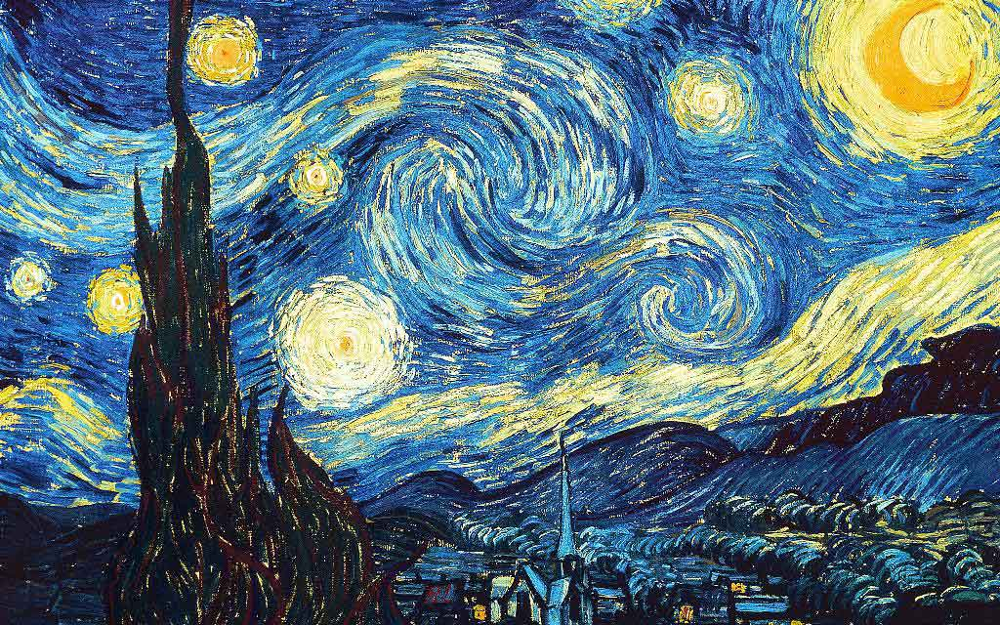
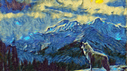

# Neural Style Transfer

This project focus on making the making the painting of the pictures using Neural Style Transfer, on some images as  __style image__ i.e. shown below

and pictures which we want to have paintings of i.e
  __content images__(the pictures we want painted) 

and generated image will be 


another image is

and generated image will look like


## Introduction
The content and style images will be fed into neural network and their features are extracted then the difference between the generated image,style image and generated image,content image are summed to produce total loss which is then optimized. The generated image features are adjusted according to the total loss.

## Technologies
The languages and libraries used are :-
* Python: 3.7
* Pytorch
* Matplotlib
* Numpy

## Launch
The pytorch library can be installed using command ```!pip install torch``` and ```!pip install torchvision``` . The code can be executed using ```python neural_style_transfer.py```

## Inspiration
The model was inspired by the Coursera Deeplearning.ai specialization and also for more insipartion you can ["click_here"](https://towardsdatascience.com/light-on-math-machine-learning-intuitive-guide-to-neural-style-transfer-, "Neural Style Transfer") and also this ["video"](https://www.youtube.com/watch?v=0tTRA3emrr4&list=PLbMqOoYQ3MxwV-xLpzWNQ70IvctU7H-yl&index=2&t=645s, "Neural Style Transfer") .For pytorch tutorials you can prefer this ["link"](https://www.youtube.com/playlist?list=PLbMqOoYQ3Mxw1Sl5iAAV4SJmvnAGAhFvK, "Pytorch Tutorial") 